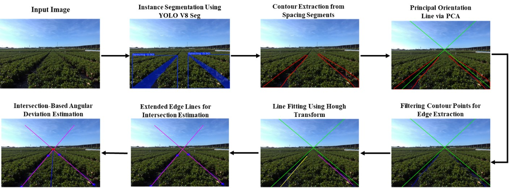
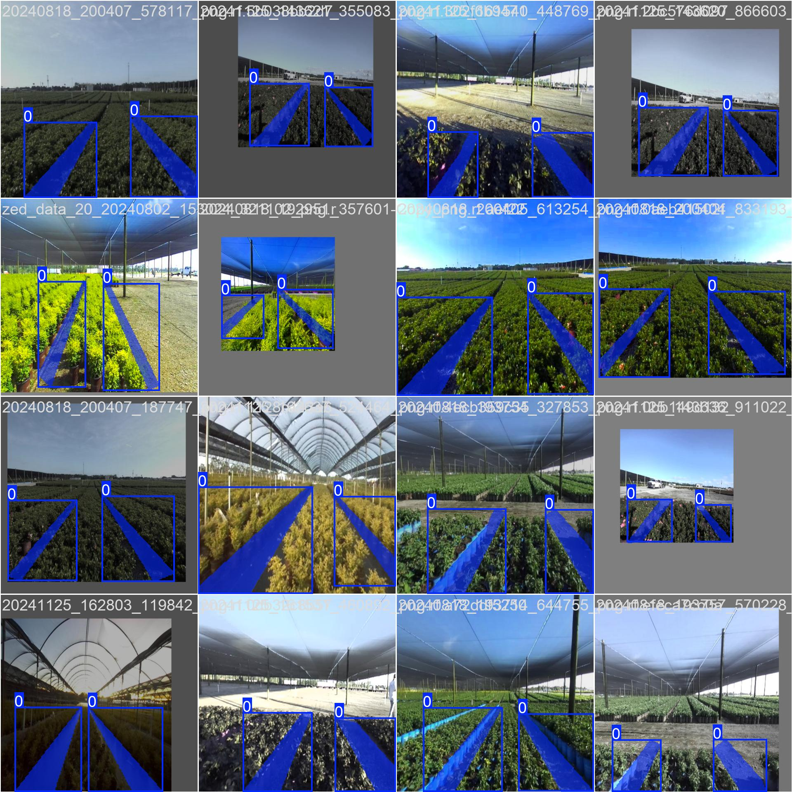
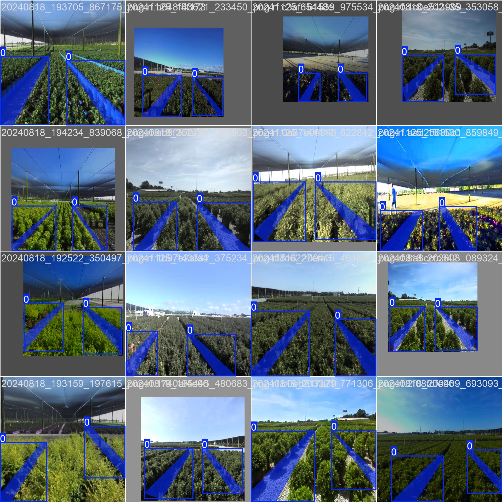
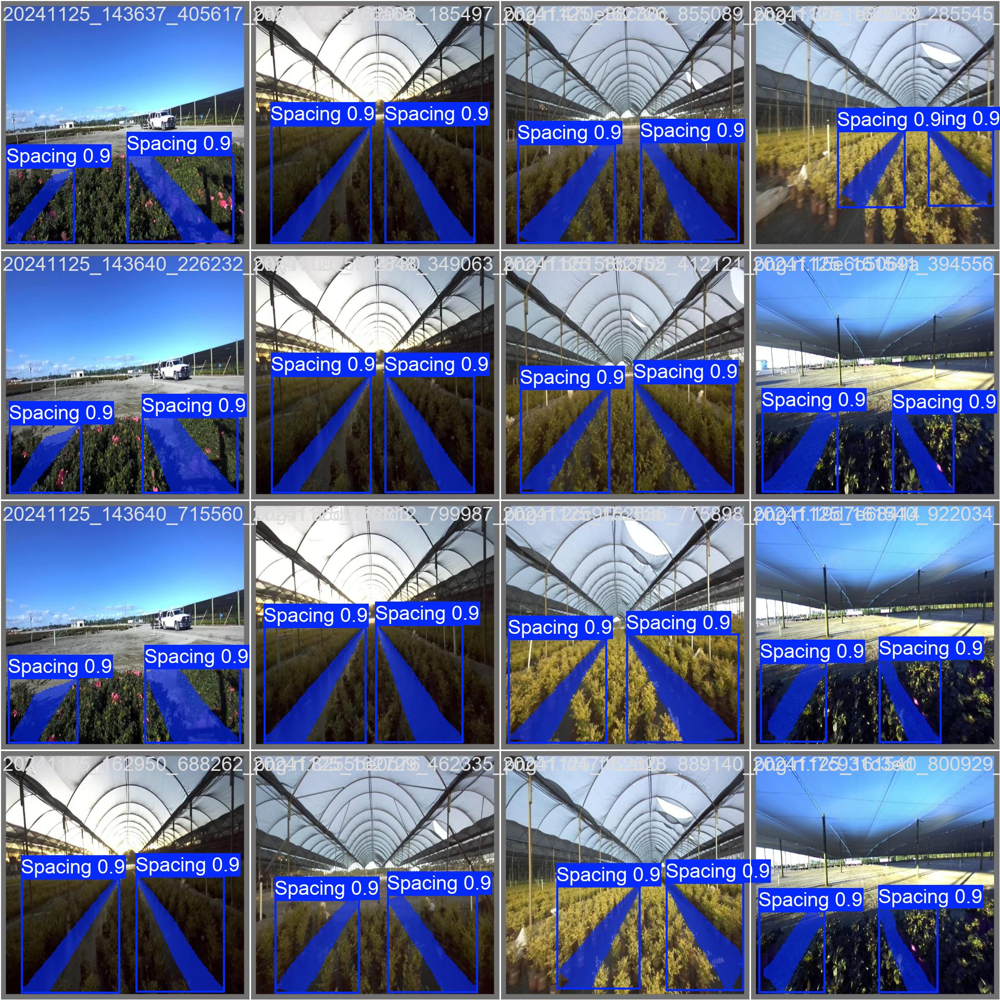
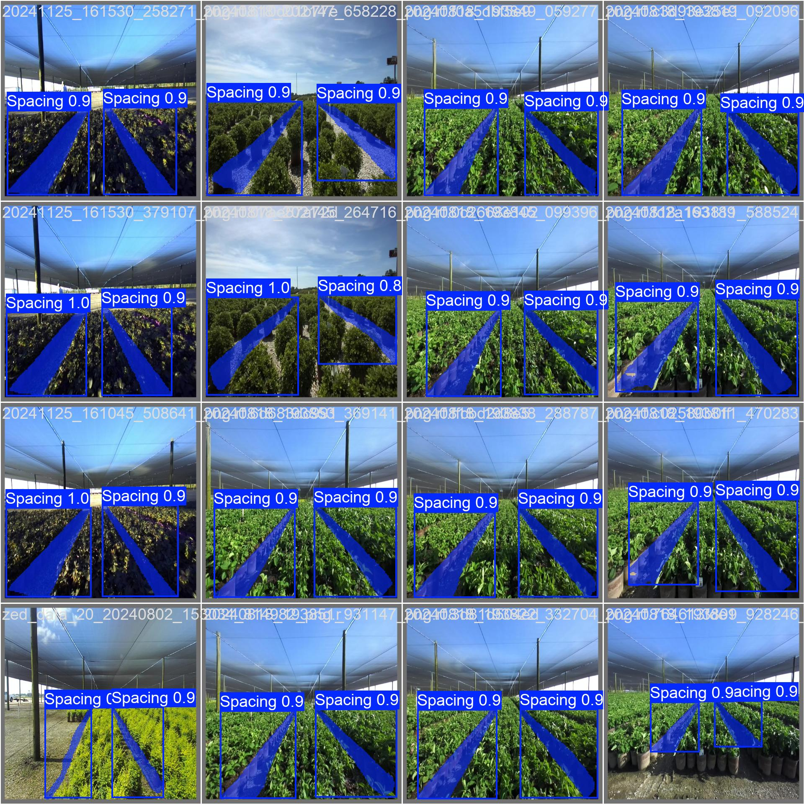

# STRIDE-Net

**Segmented Topological Recognition & Instance Detection Edge Network**

This repository provides open materials for **STRIDE-Net**, a hybrid perception approach for **intra-bed navigation** in structured ornamental nurseries. The method combines **YOLOv8 instance segmentation** of inter-row spacing with **classical geometric refinement** to estimate bed geometry and **angular deviation** for stable, real-time alignment.

This repository is maintained by the **Smart Systems Engineering (SSE) Laboratory**, Department of Biosystems Engineering, Auburn University.

**Repository:** [https://github.com/sse-auburn/stride-net](https://github.com/sse-auburn/stride-net)

---

## Contents of this repository

| Item | Description |
|------|-------------|
| [`assets/workflow.jpg`](assets/workflow.jpg) | End-to-end STRIDE-Net workflow figure |
| [`assets/`](assets/) | Representative YOLO training/validation batch previews used in the figure grid below |
| [`config/training_args.yaml`](config/training_args.yaml) | Ultralytics training configuration recorded for the released segmentation model |
| [`LICENSE`](LICENSE) | Software license for repository materials |
| [`CITATION.cff`](CITATION.cff) | Citation metadata for this repository |

---

## Workflow overview

The following figure summarizes the **eight-stage** STRIDE-Net perception pipeline, from rectified imagery to angular deviation used for lateral alignment control.



---

## Pre-trained segmentation weights

The primary **YOLOv8 segmentation checkpoint** associated with this release (**V8 – Seg(m)**) is distributed via **Google Drive**:

**Download:** [https://drive.google.com/file/d/1xUJBNYpKrlnomPXRSAzgnoEYthwa4jwd/view?usp=sharing](https://drive.google.com/file/d/1xUJBNYpKrlnomPXRSAzgnoEYthwa4jwd/view?usp=sharing)

Users should verify file integrity after download and consult the accompanying publication for the exact model variant, input resolution, and deployment context used in the reported experiments.

---

## Training configuration

Training was performed with the **Ultralytics** YOLOv8 segmentation stack. The **full hyperparameter and run configuration** exported at the end of training is archived in this repository as:

**[`config/training_args.yaml`](config/training_args.yaml)**

The table below highlights **key settings** for reproducibility and peer review. Values are taken from that file; any parameter not listed should be read directly from the YAML.

| Setting | Value |
|---------|--------|
| Task | Instance segmentation |
| Input image size (`imgsz`) | 640 |
| Training epochs | 150 |
| Batch size | 16 |
| Optimizer | Auto (Ultralytics default) |
| Random seed | 0 |
| Deterministic training | Enabled |
| Mixed precision (AMP) | Enabled |
| Initial learning rate (`lr0`) | 0.01 |
| Warmup epochs | 3.0 |
| Patience (early stopping) | 100 |
| Data descriptor | `yolo_dataset/data.yaml` (local path at training time) |

Continued or resumed training from a prior checkpoint is reflected in the `model` entry of `training_args.yaml` (reference to a previous run’s `last.pt`). Investigators reproducing the pipeline should follow the same **train/validation split** and **class definitions** as in the original `data.yaml` used on the training workstation.

---

## Representative segmentation outputs

The grid below shows **Ultralytics-generated batch visualizations** (annotated training batches and validation predictions) illustrating **spacing** detection and masks. Image paths use **forward slashes** so they render correctly on GitHub.

<table>
  <tr>
    <td align="center"><b>Training batch (sample 1)</b><br/></td>
    <td align="center"><b>Training batch (sample 2)</b><br/></td>
  </tr>
  <tr>
    <td align="center"><b>Validation predictions (sample 1)</b><br/></td>
    <td align="center"><b>Validation predictions (sample 2)</b><br/></td>
  </tr>
</table>

---

## Quick Start

The steps below reproduce the **Ultralytics YOLOv8 segmentation** with the released checkpoint. They do **not** implement the full STRIDE-Net geometric pipeline (PCA, Hough line fitting, vanishing-point-based angular deviation). 

### 1. Clone the repository

```bash
git clone https://github.com/sse-auburn/stride-net.git
cd stride-net
```

### 2. Create and activate a virtual environment

**Windows (PowerShell)**

```powershell
python -m venv .venv
.\.venv\Scripts\Activate.ps1
```

**Linux or macOS**

```bash
python3 -m venv .venv
source .venv/bin/activate
```

### 3. Install dependencies and download the checkpoint

```bash
pip install --upgrade pip
pip install ultralytics gdown
mkdir weights
gdown 1xUJBNYpKrlnomPXRSAzgnoEYthwa4jwd -O weights/stride_seg_m.pt
```

If you prefer not to use `gdown`, download **V8 – Seg(m)** manually from Google Drive (link above), then save the file as `weights/stride_seg_m.pt` in this folder.

### 4. Run inference on a single image

```python
from ultralytics import YOLO

model = YOLO("weights/stride_seg_m.pt")
model.predict(source="sample.jpg", imgsz=640, save=True, project="runs", name="demo")
```

Ultralytics writes masks and preview images under `runs/demo/` (exact layout may depend on your installed `ultralytics` version).

---

## STRIDE-Net methodology (conceptual description)

STRIDE-Net operates on **forward-facing RGB** imagery from a field robot, at the **same nominal input resolution** used for YOLO training (for example, 640×640 after letterboxing or resizing, consistent with the training configuration). The stages are **sequential**; each stage consumes the output of the previous one.

1. **Image acquisition**  
   Rectified images are acquired under nursery field conditions and prepared for inference in a manner **consistent** with training (color handling, resizing, and any calibration policy used in the study).

2. **Instance segmentation (YOLOv8)**  
   A **YOLOv8 segmentation** model segments **spacing regions** between plant beds. The network produces **instance masks** for each detected spacing region.

3. **Contour extraction and lateral assignment**  
   For each spacing mask, **closed contours** are extracted along the mask boundary. Contours provide a discrete boundary representation suitable for geometric processing. **When two dominant spacing regions are present**, **spatial reasoning** (for example, centroid position relative to the image horizontal extent) assigns which contour corresponds to the **left** spacing and which to the **right**.

4. **Principal orientation (PCA)**  
   **Principal Component Analysis** is applied to the contour points of each spacing region to obtain the **dominant orientation** of the corridor.

5. **Filtering contour points for edge extraction**  
   The PCA orientation supports **filtering** of contour points so that points belonging to **adjacent** beds or irrelevant structure are suppressed, retaining points that support the **near** bed boundaries.

6. **Line fitting (Hough transform)**  
   On the **filtered** point sets, a **probabilistic Hough** (or equivalent Hough-based) line fit estimates **straight-line** approximations to the **left and right** bed-edge guidance cues in the image plane. Parameters such as **accumulator threshold**, **minimum line length**, and **maximum gap** follow the values reported in the manuscript.

7. **Vanishing-point construction**  
   The two fitted lines are **extended** in the image plane until they **intersect**. That intersection is treated as a **vanishing point** indicative of **parallel row geometry** under perspective projection.

8. **Angular deviation**  
   The vanishing point is compared to a **reference axis** (for example, the image principal point or a vertical reference through the image center). The resulting **angular deviation** quantifies **lateral misalignment** of the robot with respect to the bed centerline and is suitable for use in a **closed-loop steering** or **velocity-command** law, optionally fused with other modalities (e.g., sonar or odometry) as described in the full paper.

No implementation source code for these geometric stages is included in this repository under the current release scope; the description above is intended to align with the **peer-reviewed methodological narrative** and the **workflow figure**.

---

## Evaluation dataset

The **full evaluation dataset** (large-scale synchronized imagery and related metadata from commercial nursery campaigns) is **not** posted publicly in this repository because of **volume**, **privacy agreements**, and **institutional data-handling** constraints.

**The evaluation dataset is available on reasonable request** to qualified researchers and peer reviewers. Requests should be directed to the **corresponding author** or the **SSE Laboratory**, Department of Biosystems Engineering, Auburn University, and should specify the intended **non-commercial research** or **reproducibility** use. Redistribution of received materials may be subject to a **data-use agreement**.

---

## Disclaimer

Weights, configurations, and figures are provided **for research and reproducibility** in good faith. Field deployment requires **site-specific validation**, **safety assessment**, and compliance with **local regulations** and **institutional policies**. The authors and Auburn University make **no warranty** as to fitness for a particular purpose; see [`LICENSE`](LICENSE).

---

## Acknowledgments

Development of STRIDE-Net was carried out in the context of autonomous nursery robotics research at **Auburn University**. Funding and partner acknowledgments are stated in the associated publication.
